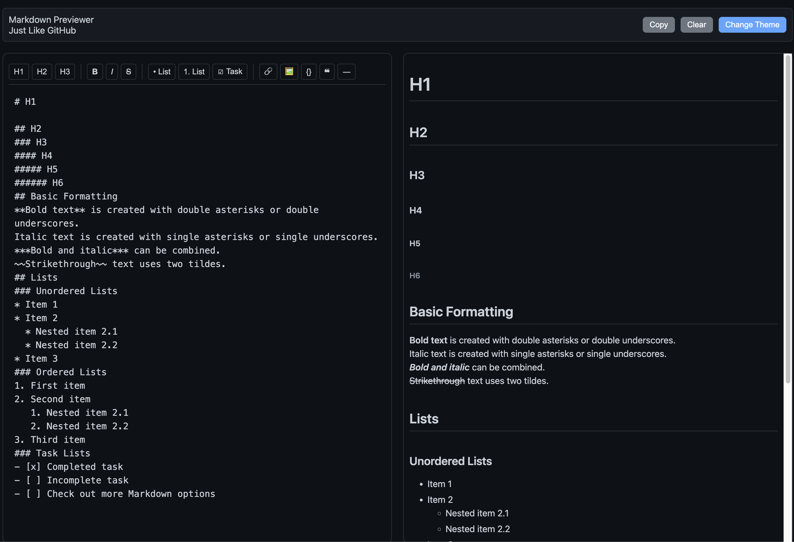

# GitHub-Style Markdown Previewer

A sleek, responsive markdown editor and previewer that looks and feels just like GitHub's markdown experience. Write your markdown on the left, see the rendered preview on the right in real-time.

## 🔗 Live Demo

[View Live Demo](https://learn.dipanshu.dev/github-markdown-previewer/)

## ✨ Features

- **Real-time Preview**: See your markdown rendered instantly as you type
- **GitHub Styling**: Preview looks exactly like GitHub's markdown rendering
- **Formatting Toolbar**: Easy-to-use buttons for common markdown elements
- **Dark/Light Mode**: Toggle between themes with a single click
- **Local Storage**: Automatically saves your content and theme preference
- **Responsive Design**: Works perfectly on desktop and mobile devices
- **Copy & Clear**: One-click buttons to copy or clear your markdown

## 🛠️ Formatting Options

The editor includes a comprehensive formatting toolbar with buttons for:

- Headings (H1, H2, H3)
- Text formatting (Bold, Italic, Strikethrough)
- Lists (Bulleted, Numbered, Task lists)
- Links and Images
- Code blocks
- Blockquotes
- Horizontal rules

## 💾 Persistent Storage

Your markdown content is automatically saved to your browser's local storage. If you close the page or your browser crashes, your work will be there when you return.

## 🎨 Themes

Switch between light and dark themes to match your preference or reduce eye strain.

## 📦 Technology Stack

- **HTML5**: Modern semantic markup
- **CSS3**: Responsive design with custom properties for theming
- **JavaScript**: Vanilla JS for all functionality
- **Marked.js**: For markdown parsing
- **Highlight.js**: For code syntax highlighting

## 📝 Usage Examples

Perfect for:

- Writing README files for GitHub projects
- Drafting blog posts or documentation
- Creating notes with rich formatting

---

Made with ❤️ by Dipanshu
